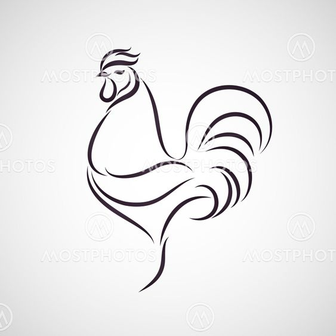
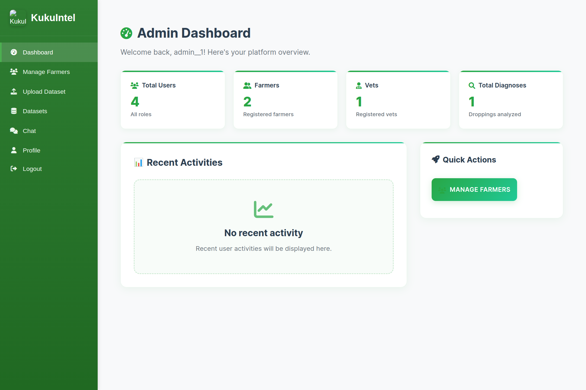

# KukuIntel

**An AI-Powered Chicken Health Detection System**

## Problem Statement and Context

In many developing countries, poultry farmers are losing birds and income because they detect diseases too late. Deadly gut diseases like coccidiosis, salmonella, and Newcastle disease cause up to 80% of chicken deaths, often spreading before farmers even know there's a problem. These diseases leave early signs in chicken droppings, but without tools to spot them, farmers can't act in time.

In Uganda, over 4.8 million households rely on poultry farming. Most are small-scale farmers with 50–500 birds and no regular access to vets or lab testing. A single outbreak can wipe out half a flock in days, pushing families deeper into poverty.

As one farmer said, "We only notice sickness when birds stop eating or start dying." The current system depends on chicken behavior which is often too late. Farmers urgently need an early, simple, and affordable way to detect disease before it's too late.

## Solution

To address those farmer's problems we came up with a new product called KukuIntel which is an AI-powered mobile platform that helps smallholder poultry farmers detect deadly gut diseases like coccidiosis, Newcastle disease, and salmonella early just by snapping a photo of chicken droppings. Using a deep learning model (EfficientNetB3) with 98.3% accuracy, it gives instant diagnosis and treatment advice right on a basic smartphone.

Farmers get a simple, easy-to-use app with clear guidance. Veterinarians can monitor cases remotely, offer expert advice, and manage outbreaks without being on-site. Behind the scenes, admins maintain system quality and update the AI model to keep accuracy high.

KukuIntel tackles the core problem of late disease detection by turning every farmer's phone into a diagnostic tool and a direct line to vet support. It's not just a tool it's a must-have ally that helps farmers prevent losses, save flocks, and protect their income.

*Figure 1: Farmer using KukuIntel for disease detection*

## Project Overview

KukuIntel is a mobile-first platform that gives rural poultry farmers a smart, affordable way to protect their flocks. It uses artificial intelligence to help them spot diseases early and get treatment advice without needing a vet on-site.

What makes KukuIntel stand out is how it brings expert-level diagnostics to small farms using just a smartphone which is something farmers already have. The platform also connects them to real veterinarians when needed, helping bridge the gap between remote farmers and expert care.

It's a practical, everyday tool built for real farming challenges and it helps keep more birds alive, food on the table, and money in farmers' pockets.

*Figure 2: KukuIntel Brand Logo*

## Current Development Status

KukuIntel has successfully completed its prototype development phase and undergone extensive field testing with real-world user scenarios in Uganda. The platform currently features a fully functional web-based application with an AI model achieving 98.27% accuracy in disease detection. The system has been validated through direct collaboration with local farmers who have provided actual chicken dropping samples for analysis, demonstrating the practical viability of the technology in authentic agricultural environments.

The next critical phase of KukuIntel's journey is poised to bring the platform to life at scale. We are seeking funding to move beyond the prototype and launch full production deployment, complete the mobile application, and integrate real-time camera monitoring for continuous, automated health surveillance. This phase isn't just about improving technology it's about delivering impact. With the right support, KukuIntel will evolve into a scalable, field-ready solution capable of empowering thousands of farmers across regions, transforming how poultry health is managed in the places that need it most.

*Figure 3: Field research with local farmers in Uganda*

*Figure 4: Impact of disease outbreak on poultry farm*

## Technical Implementation and Infrastructure

The technical infrastructure of KukuIntel demonstrates a sophisticated approach to cloud-based agricultural technology deployment. The system utilizes Django as the primary web framework, providing robust backend functionality and seamless integration with machine learning components. The AI inference engine incorporates TensorFlow 2.9.1 for model deployment, ensuring reliable and efficient image analysis capabilities.

Data management relies on PostgreSQL databases hosted through Supabase, providing scalable and secure storage for user data, analysis history, and system analytics. The cloud infrastructure leverages Google Cloud Platform services, including Cloud Run for containerized application deployment, Cloud Storage for media file management, and Cloud Build for automated continuous integration and deployment pipelines.

The deployment strategy utilizes Docker containerization to ensure consistent performance across different environments and facilitate seamless scaling as user demand increases. The cloud deployment configuration demonstrates sophisticated environment management with secure handling of sensitive information through Google Cloud's substitution variable system.

## Disease Detection Workflow and User Experience

The disease detection process represents the core value proposition of KukuIntel, designed to be both scientifically rigorous and practically accessible for farmers with varying levels of technical expertise. The workflow begins with farmers capturing smartphone images of chicken droppings, which are then uploaded through the platform's intuitive interface.

*Figure 5: Image upload interface for disease detection*

Upon image submission, the AI model performs rapid analysis, typically completing diagnosis within seconds of upload. The system provides comprehensive results including disease classification with confidence percentages, detailed treatment protocols, preventive measures for flock protection, and immediate action items for emergency situations.

The user experience prioritizes clarity and actionability, presenting complex veterinary information in easily understandable formats. Treatment recommendations include specific medication dosages, administration methods, and timeline expectations. Prevention guidance encompasses environmental management, nutritional adjustments, and ongoing monitoring protocols to reduce future disease risk.

Historical tracking capabilities allow farmers to monitor flock health trends over time, identifying patterns that may indicate environmental or management factors contributing to disease susceptibility. This longitudinal data proves invaluable for both farmers and consulting veterinarians in developing comprehensive flock health strategies.

## Multi-User Platform Architecture

KukuIntel's multi-user architecture recognizes that effective agricultural health management requires collaboration between multiple stakeholders, each with distinct needs and expertise levels. The platform facilitates seamless interaction between farmers, veterinarians, and system administrators while maintaining appropriate access controls and data privacy protections.

The farmer interface emphasizes simplicity and immediate utility, providing essential tools for disease detection, treatment guidance, and flock management without overwhelming users with technical complexity. Farmers can access their complete analysis history, track treatment outcomes, and communicate directly with veterinary professionals for complex cases requiring expert consultation.

*Figure 6: Farmer dashboard interface showing analysis history and health monitoring*

Veterinary professionals utilize advanced dashboard capabilities that provide comprehensive oversight of multiple farms and patients. The veterinary interface includes tools for remote consultation, detailed report generation, trend analysis across multiple flocks, and direct communication with farmers. This remote consultation capability significantly extends the reach of veterinary expertise, particularly valuable in regions where physical veterinary presence is limited.

*Figure 7: Veterinarian dashboard for managing multiple farms and consultations*

*Figure 8: Veterinary consultation chat interface*

System administrators maintain platform integrity through comprehensive management tools covering user authentication, data quality assurance, AI model performance monitoring, and system analytics. Administrative capabilities include dataset management for ongoing model improvement, user support and training coordination, and platform configuration optimization.

*Figure 9: Administrator dashboard for system management*

*Figure 10: Admin interface for farmer management and support*

*Figure 11: Administrative communication interface*

## Market Analysis and Economic Context

The market opportunity for KukuIntel reflects both the scale of poultry farming in developing regions and the urgent need for accessible health management solutions. Uganda's poultry sector, representative of many East African markets, comprises approximately 57.8 million chickens distributed across 4.8 million households, with 70-80% of operations classified as small-scale or free-range farming.

Disease-related mortality represents the primary threat to productivity and profitability in this sector, with Newcastle disease and coccidiosis identified as leading causes of livestock losses. Traditional veterinary intervention models prove inadequate for small-scale farmers due to cost barriers, geographical accessibility challenges, and the reactive nature of symptom-based diagnosis.

The economic impact of disease outbreaks extends beyond immediate livestock losses to include reduced productivity, compromised food security, and perpetuated rural poverty. KukuIntel's value proposition addresses these challenges by providing affordable, accessible early detection capabilities that enable proactive disease management and significantly reduce the likelihood of catastrophic flock losses.

The pricing strategy reflects careful consideration of farmer economic realities, with a one-month free trial period allowing farmers to experience the platform's value firsthand, followed by a monthly subscription of UGX 20,000 (approximately $5.50 USD). This pricing structure represents a fraction of traditional veterinary consultation costs while providing 24/7 access to diagnostic capabilities.

## Future Development Roadmap

The future development of KukuIntel encompasses three distinct phases of technological advancement, each building upon the foundation of current capabilities to create an increasingly comprehensive poultry health management ecosystem.

Phase One focuses on artificial intelligence enhancement and expanded diagnostic capabilities. This phase includes the development of real-time video analysis systems capable of continuous flock monitoring without human intervention. Behavioral pattern recognition algorithms will identify disease indicators through movement analysis, breathing pattern assessment, and postural abnormalities. The diagnostic scope will expand to include respiratory diseases, viral infections, and nutritional deficiencies, significantly broadening the platform's utility for comprehensive flock health management.

The implementation of real-time video monitoring represents a significant technological advancement that will transform KukuIntel from a reactive diagnostic tool into a proactive health surveillance system. Computer vision algorithms will continuously analyze flock behavior, identifying subtle changes in movement patterns, feeding behaviors, and social interactions that may indicate early stages of disease development. This continuous monitoring capability will enable intervention at the earliest possible stages, potentially preventing disease outbreaks entirely rather than merely detecting them after symptoms appear.

*Figure 12: Future camera tracking system for continuous monitoring*

Phase Two introduces smart farm integration capabilities, transforming KukuIntel from a diagnostic tool into a comprehensive farm management system. Internet of Things sensor integration will provide continuous environmental monitoring, tracking temperature, humidity, air quality, and other factors affecting poultry health. Predictive analytics algorithms will analyze historical data patterns to forecast potential disease outbreaks before symptoms become apparent. Automated systems integration will enable intelligent control of feeding systems, water dispensers, and environmental controls based on real-time flock health data.

The smart farm integration phase will establish KukuIntel as a central hub for all farm management activities, coordinating multiple technological systems to optimize poultry health and productivity. Environmental sensors will provide continuous data streams that feed into machine learning algorithms capable of identifying correlations between environmental conditions and disease susceptibility. This predictive capability will enable farmers to adjust environmental controls proactively, maintaining optimal conditions for flock health.

Phase Three represents the evolution toward complete agricultural intelligence, incorporating advanced features such as nutritional optimization algorithms, genetic analysis for breeding guidance, and market intelligence for optimal sales timing. This comprehensive approach addresses all aspects of poultry farming operations, from day-old chick management through market-ready bird preparation.

The nutritional optimization component will analyze individual bird growth patterns, feed conversion ratios, and health indicators to recommend personalized feeding strategies that maximize growth while minimizing feed costs. Genetic analysis capabilities will help farmers make informed breeding decisions, selecting birds with optimal disease resistance and productivity characteristics. Market intelligence features will integrate commodity pricing data, demand forecasts, and seasonal trends to recommend optimal timing for bird sales, maximizing revenue potential.

## Specific Technological Advancements

Future technological enhancements will address specific disease detection challenges and expand diagnostic capabilities beyond current gut disease focus. Avian influenza detection will utilize activity level monitoring algorithms that identify characteristic lethargy and reduced movement patterns associated with viral infection. The system will establish baseline activity levels for individual birds and flock aggregates, triggering alerts when activity patterns deviate significantly from established norms.

Respiratory infection diagnosis will incorporate breathing pattern analysis through video monitoring, detecting abnormal respiratory rates and breathing difficulties. Advanced computer vision algorithms will analyze chest movement patterns, head positioning, and beak positioning to identify respiratory distress indicators. This capability will prove particularly valuable for early detection of respiratory diseases that may not initially affect dropping characteristics.

Marek's disease identification will focus on posture and movement analysis, detecting the characteristic paralysis and coordination problems associated with this viral condition. Machine learning algorithms will analyze gait patterns, wing positioning, and balance indicators to identify neurological symptoms. Early detection of Marek's disease will enable farmers to implement management strategies that prevent transmission to healthy birds.

Fowl cholera diagnosis will combine behavioral analysis with movement pattern recognition to identify the sudden onset lethargy and behavioral changes typical of this bacterial infection. The system will monitor feeding behaviors, social interactions, and general activity levels to detect rapid changes that may indicate acute bacterial infection.

Environmental integration capabilities will include automated chick warming systems that respond to temperature fluctuations and individual chick behavior patterns. Smart heating systems will adjust temperature zones based on chick clustering behaviors and individual activity levels, ensuring optimal thermal comfort without energy waste. Temperature monitoring will extend beyond simple ambient temperature measurement to include localized microclimate analysis.

Smart feeding systems will adjust feed dispensing based on flock appetite patterns, growth rates, and nutritional requirements. Feed consumption monitoring will track individual and group feeding behaviors, identifying birds with reduced appetite that may indicate early illness. Automated feed quality assessment will ensure optimal nutrition while minimizing waste and cost.

Real-time alert systems will notify farmers immediately when behavioral or environmental patterns indicate potential health concerns. Alert algorithms will integrate multiple data streams including environmental sensors, behavioral monitoring, and historical health patterns to minimize false alarms while ensuring critical health issues receive immediate attention.

User experience improvements will include offline functionality to reduce internet dependency in rural areas where connectivity may be intermittent or unreliable. Edge computing capabilities will enable local AI inference, allowing farmers to perform disease analysis even when internet connectivity is unavailable. Synchronized data upload will occur automatically when connectivity is restored.

Voice command interfaces will provide hands-free operation during farm work, allowing farmers to interact with the system while performing other tasks. Natural language processing will enable farmers to query the system about flock health, receive verbal reports on recent analyses, and request specific information about treatment protocols.

Augmented reality features will provide guided health inspections, overlaying digital information onto real-world farm environments through smartphone cameras. AR guidance will help farmers identify optimal sampling locations, proper image capture techniques, and visual indicators of health problems that may not be immediately obvious to untrained observers.

Native mobile applications for iOS and Android platforms will provide optimized performance and enhanced user experience compared to current web-based interfaces. Mobile applications will include offline synchronization, push notifications for critical alerts, and integration with smartphone cameras for seamless image capture and analysis.

## Impact Assessment and Projected Outcomes

Current achievements demonstrate the technical viability and practical utility of KukuIntel's approach to AI-powered poultry health management. The 98.27% accuracy rate achieved by the diagnostic model represents performance comparable to professional veterinary assessment, while the successful field testing with real farmer participants validates the platform's usability and effectiveness in authentic agricultural environments.

The fully functional web platform demonstrates comprehensive multi-user capability, secure cloud infrastructure deployment, and seamless integration of AI components with user-friendly interfaces. Google Cloud Platform infrastructure provides scalable, reliable hosting capable of supporting thousands of concurrent users while maintaining data security and privacy protections.

Projected impact assessments indicate significant potential benefits for farmers adopting KukuIntel technology. Early disease detection capabilities could reduce livestock mortality by 40-60% through timely intervention and treatment. This mortality reduction translates directly into income protection, as farmers avoid the catastrophic losses that currently characterize disease outbreaks in small-scale operations.

Cost savings of 50-70% on veterinary expenses become achievable through reduced need for emergency consultations and treatment of advanced disease stages. The preventive approach enabled by early detection significantly reduces treatment costs while improving treatment success rates. Farmers will spend less on medications and veterinary services while achieving better health outcomes for their flocks.

Income protection represents perhaps the most significant benefit, as prevention of catastrophic flock losses ensures consistent revenue generation and long-term agricultural sustainability. Stable income streams enable farmers to invest in flock expansion, facility improvements, and enhanced management practices that further improve productivity and profitability.

Educational impact through platform usage will improve overall farm management practices, creating lasting benefits beyond immediate disease prevention. Farmers will develop better understanding of disease indicators, environmental factors affecting flock health, and optimal management practices. This knowledge transfer creates sustainable improvements in agricultural practices that benefit farmers throughout their careers.

The broader economic impact extends beyond individual farms to rural communities and national agricultural productivity. Reduced livestock mortality rates contribute to food security, while improved farm profitability supports rural economic development and poverty reduction efforts.

*Figure 13: Platform interface showing real-time analysis results*

## Success Metrics and Performance Indicators

Success measurement for KukuIntel encompasses both quantitative performance indicators and qualitative impact assessments across multiple dimensions of agricultural improvement. User adoption metrics target onboarding 1,000 active farmers within the first operational year, with geographic distribution spanning multiple regions to validate scalability and cultural adaptability.

Geographic distribution analysis will track platform adoption across different agro-ecological zones, farming systems, and socioeconomic contexts to ensure broad applicability. Success metrics will include farmer retention rates, frequency of platform usage, and progression from basic disease detection to advanced farm management features.

Diagnostic accuracy improvement represents an ongoing objective, with continuous model enhancement through expanded datasets and user feedback integration. Target accuracy improvements of 20% or more demonstrate the value of real-world data collection and iterative model refinement. Accuracy metrics will be tracked separately for different disease types, environmental conditions, and user demographics to ensure consistent performance across diverse scenarios.

Economic impact measurement includes documented cost savings for platform users, quantified through comparison of veterinary expenses before and after KukuIntel adoption. Income stability metrics will track revenue consistency and flock productivity improvements among participating farmers. Return on investment calculations will demonstrate the financial benefits of platform subscription relative to traditional health management approaches.

Livestock mortality reduction metrics will track disease-related death rates among participating farmers, providing concrete evidence of platform effectiveness in protecting farmer investments. Mortality data will be analyzed by disease type, farm size, and management practices to identify factors contributing to improved outcomes.

Veterinary partnership development aims to establish collaboration with 10 or more veterinary professionals actively utilizing the platform for remote consultation and patient management. This metric validates the platform's utility for professional users while ensuring farmers receive appropriate expert guidance for complex health situations. Partnership quality will be measured through consultation frequency, farmer satisfaction ratings, and health outcome improvements.

Knowledge transfer assessment will evaluate improvements in farmer understanding of disease prevention, recognition of health indicators, and implementation of recommended management practices. Educational impact will be measured through pre- and post-adoption assessments of farmer knowledge and practice implementation.

Platform performance metrics will track system reliability, response times, and user satisfaction ratings to ensure technical performance meets user expectations. Cloud infrastructure monitoring will maintain service quality standards while accommodating user growth and feature expansion.

## Business Model and Sustainability Framework

The business model for KukuIntel emphasizes long-term sustainability through diversified revenue streams that align platform growth with user value creation. The primary subscription model provides predictable recurring revenue while maintaining affordability for target users. Farmer subscription pricing reflects careful analysis of rural economic conditions and competitor service costs, ensuring accessibility while supporting platform development and maintenance.

Veterinary partnership programs generate commission-based revenue through consultation referrals and professional service facilitation. Veterinary professionals benefit from expanded patient reach and efficient remote consultation capabilities, while farmers receive expert guidance for complex health issues. Revenue sharing arrangements incentivize veterinary participation while maintaining cost-effectiveness for farmers.

Data analytics services offer additional revenue potential through anonymized agricultural insights valuable for research institutions, government agencies, and agricultural development organizations. Aggregated health data provides valuable insights into disease patterns, environmental factors affecting poultry health, and effectiveness of intervention strategies. Data monetization maintains strict privacy protections while generating revenue to support continued platform development.

Premium feature offerings, including advanced analytics and smart farm integrations, provide upgrade pathways for users requiring sophisticated capabilities. Premium tiers will include enhanced reporting, predictive analytics, integration with IoT devices, and priority support services. Tiered pricing enables platform scalability while accommodating diverse user needs and financial capabilities.

The funding requirement of UGX 10 million (approximately $2,700 USD) supports critical development objectives including regional deployment and user acquisition campaigns, AI model optimization for expanded disease detection, real-time camera tracking system development, mobile application creation, field research and validation studies, and smart system integration capabilities.

Regional deployment funding will support marketing campaigns, farmer training programs, and technical support infrastructure necessary for successful platform adoption. User acquisition strategies will include partnerships with agricultural extension services, farmer cooperatives, and rural development organizations.

AI model optimization investment will expand disease detection capabilities, improve accuracy for existing conditions, and adapt algorithms for regional disease patterns and farming practices. Model development will include data collection, algorithm training, validation testing, and deployment of enhanced diagnostic capabilities.

Real-time camera tracking development represents a significant technological advancement requiring specialized expertise in computer vision, behavioral analysis, and edge computing. Investment will support algorithm development, hardware integration testing, and user interface design for video monitoring capabilities.

Mobile application development will create native applications for iOS and Android platforms, providing enhanced user experience and offline functionality. Application development includes user interface design, backend integration, security implementation, and performance optimization for diverse device capabilities.

Field research and validation studies will provide scientific evidence of platform effectiveness while identifying optimization opportunities. Research investment supports data collection, statistical analysis, publication of findings, and evidence-based marketing to agricultural stakeholders.

This investment level reflects careful consideration of development priorities and market entry requirements, focusing resources on capabilities that provide maximum user value and platform differentiation.

## Competitive Advantages and Market Positioning

KukuIntel's competitive position reflects several significant advantages that differentiate the platform from alternative approaches to poultry health management. First-mover advantage in AI-powered poultry diagnostics for small-scale farmers in East Africa provides market positioning benefits and brand recognition opportunities.

The combination of advanced AI technology with farmer-friendly interfaces creates a unique value proposition that addresses both technical sophistication and practical usability. Competitors typically focus either on high-tech solutions for commercial operations or basic educational resources for small-scale farmers, leaving a gap that KukuIntel fills effectively.

Affordability compared to traditional veterinary services represents a fundamental value proposition, making advanced diagnostic capabilities accessible to farmers previously excluded from professional health management services. The subscription pricing model provides predictable costs that farmers can budget for, unlike unpredictable veterinary emergency expenses.

The smartphone-based approach requires minimal technical expertise while leveraging technology already prevalent in target markets. Platform design prioritizes simplicity and intuitive operation, ensuring successful adoption even among farmers with limited technological experience.

Continuous learning capabilities enable the AI model to improve accuracy and expand diagnostic scope through ongoing use, creating increasing value for users over time. Each analysis contributes to model enhancement, ensuring platform performance improves with scale and user engagement.

The comprehensive platform approach integrating farmer, veterinary, and administrative capabilities provides holistic solutions rather than point-specific tools. Users benefit from seamless integration of diagnostic capabilities, expert consultation, and farm management tools within a single platform.

Scalability through cloud infrastructure ensures the platform can accommodate rapid user growth without performance degradation or service interruption. Google Cloud Platform provides enterprise-grade reliability and security while supporting global expansion potential.

Local adaptation capabilities allow customization for regional disease patterns, farming practices, and cultural preferences. Platform flexibility ensures relevance across diverse agricultural contexts while maintaining core functionality and user experience standards.

## Research and Development Initiatives

Ongoing research and development activities focus on expanding platform capabilities while maintaining user accessibility and diagnostic accuracy. Collaborative partnerships with veterinary colleges and agricultural research institutions provide access to expertise and validation opportunities for new diagnostic algorithms.

University partnerships include collaborative research projects, student internship programs, and access to specialized facilities for algorithm development and testing. Academic collaboration ensures scientific rigor in platform development while providing educational opportunities for agricultural and computer science students.

Field research initiatives continue user studies with farmer communities to understand evolving needs and identify optimization opportunities. Research methodologies include participant observation, structured interviews, focus group discussions, and quantitative analysis of platform usage patterns.

Disease pattern analysis across different geographical regions and seasonal variations informs model enhancement priorities and expansion planning. Epidemiological research identifies regional disease prevalence, seasonal patterns, and environmental factors affecting disease development.

Technical innovation focuses on edge computing optimization for low-resource environments, ensuring platform functionality in areas with limited internet connectivity or device capabilities. Edge computing research includes algorithm compression, local inference optimization, and synchronization protocols for offline operation.

Transfer learning approaches enable rapid model adaptation for different geographical regions without requiring extensive local training data. Research includes cross-regional model validation, adaptation algorithms, and cultural customization requirements.

Computer vision advancement addresses challenging conditions such as variable lighting, different smartphone cameras, and diverse environmental factors that may affect image quality. Image processing research includes noise reduction, lighting normalization, and camera calibration techniques.

Federated learning approaches enable privacy-preserving model training across distributed farms while maintaining data security and farmer privacy. Research includes distributed training algorithms, privacy protection protocols, and consensus mechanisms for model updates.

Behavioral analysis research focuses on identifying disease indicators through movement patterns, feeding behaviors, and social interactions. Video analysis capabilities include motion tracking, behavior classification, and anomaly detection algorithms.

Environmental correlation studies examine relationships between environmental conditions and disease development to improve predictive capabilities. Research includes sensor data analysis, weather pattern correlations, and environmental optimization recommendations.

## Security, Privacy, and Reliability Framework

Data protection and privacy considerations receive paramount attention throughout platform development and deployment. All data transmission utilizes advanced encryption protocols to protect sensitive information during upload and storage processes. Encryption standards include TLS 1.3 for data in transit and AES-256 for data at rest, ensuring comprehensive protection against unauthorized access.

Farmers maintain complete control over their data, with transparent policies governing data usage and sharing permissions. Privacy controls include granular permissions for data sharing, explicit consent requirements for research participation, and user-initiated data deletion capabilities. Farmers can review all data usage, modify sharing preferences, and withdraw consent at any time.

Research data contributions remain strictly anonymized to protect farmer privacy while enabling valuable agricultural research and model improvement. Anonymization protocols include data aggregation, identifier removal, and statistical disclosure control to prevent individual identification while preserving research utility.

Compliance with international data protection standards ensures platform operation meets regulatory requirements across different markets and jurisdictions. Compliance frameworks include GDPR for European markets, local data protection laws for African markets, and industry-specific agricultural data standards.

Platform reliability depends on robust cloud infrastructure providing 99.9% uptime guarantees through Google Cloud Platform services. Infrastructure monitoring includes real-time performance tracking, automated failover systems, and redundant service deployment to ensure continuous availability.

Redundant data storage and automated backup systems protect against data loss while ensuring rapid recovery capabilities in case of system issues. Backup protocols include daily automated backups, geographic distribution of backup storage, and tested recovery procedures to minimize data loss risk.

AI model versioning and rollback capabilities ensure platform stability during model updates and algorithm improvements. Version control includes comprehensive testing protocols, gradual deployment procedures, and immediate rollback capabilities if performance issues arise.

Real-time system monitoring provides immediate alerts for performance issues or security concerns, enabling rapid response to maintain service quality. Monitoring systems include performance metrics tracking, security threat detection, and automated incident response protocols.

User authentication and access control systems protect against unauthorized access while maintaining user convenience. Security measures include multi-factor authentication options, session management protocols, and role-based access controls for different user types.

Data integrity verification ensures accurate information processing and prevents corruption during transmission or storage. Integrity measures include checksums for uploaded images, database transaction logging, and regular data validation procedures.

## Conclusion and Vision Statement

KukuIntel represents a transformative convergence of artificial intelligence technology and agricultural development, addressing critical challenges in poultry health management while creating sustainable economic opportunities for rural communities. The platform demonstrates that advanced technology can be both accessible and impactful for agricultural development in resource-constrained environments.

The comprehensive approach encompassing farmers, veterinarians, and administrators creates an ecosystem of collaboration and knowledge sharing that extends benefits beyond individual farms to entire agricultural communities. Proven AI accuracy of 98.27% combined with successful field testing validates the technical feasibility and practical utility of the platform approach.

The future vision for KukuIntel extends beyond disease detection to comprehensive smart farm management, where artificial intelligence insights, Internet of Things integration, and predictive analytics create new paradigms for sustainable agriculture. This evolution represents not merely technological advancement but fundamental transformation in how rural communities approach agricultural productivity and economic development.

With appropriate funding support, KukuIntel will scale to serve thousands of farmers across multiple regions, demonstrating the potential for AI-powered solutions to address real-world challenges while creating measurable improvements in agricultural productivity, economic stability, and food security.

The ultimate goal of KukuIntel transcends technological innovation to encompass rural empowerment, where farmers gain access to sophisticated tools previously available only to large-scale commercial operations. This democratization of agricultural technology represents a pathway toward more equitable and sustainable food systems that benefit both producers and consumers throughout the agricultural value chain.

KukuIntel embodies the principle that artificial intelligence serves humanity most effectively when it addresses fundamental human needs and creates opportunities for communities to thrive through enhanced capabilities and improved access to essential services. In the intersection of AI and agriculture, KukuIntel protects not only flocks but the livelihoods and futures of rural communities committed to feeding the world.

The platform's success will be measured not only in technical metrics and financial performance but in the transformed lives of farmers who achieve greater food security, economic stability, and agricultural sustainability through access to advanced health management tools. KukuIntel represents hope for rural communities that technology can be a force for empowerment and development rather than displacement and exclusion.

As KukuIntel evolves from prototype to production deployment, the platform will continue to prioritize user needs, community impact, and sustainable development goals. The vision encompasses a future where every farmer, regardless of location or economic status, has access to the tools and knowledge necessary for successful agricultural enterprise.

---

This comprehensive documentation represents the current state and future vision of KukuIntel, demonstrating the potential of AI technology to address real-world agricultural challenges while creating sustainable economic opportunities for rural communities. Through continued research, development, and community engagement, KukuIntel aims to become the leading platform for poultry health management in developing regions worldwide.